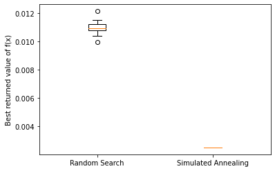

##### *This is a markdown version of the notebook available [here](./956213.ipynb)*

#### 1) I have chosen to use Simulated Annealing as my stochastic algorithm to optomise the function.
#### 2) I chose simulated annealing because it performs best when tasked with finding global minima when there are many local minimas. With the constraints presented, this seems like a great choice, especially since it is a known good general optomiser.
#### 3) For Random Search I decided to use a death penalty. This is because for this function, it is made clear that any solution must fall within certain constraints, therefore making it possible to disregard any solution not satisfying the constraints. We simply evaluate f(x) only with x values which are valid.
#### In simulated annealing, I adopted a static penalty function to help guide the algorithm towards the optimal solution whilst still allowing 'bad' options to be potentially picked (to combat local minima). This results in finding the global minima much more efficiently, as can be seen in the boxplot with the best value being picked up every time with 3000 evaluations of f(x).


```python
import numpy as np
import scipy as sc
import numpy.random as random
import math
import matplotlib.pyplot as plt
from scipy.stats import multivariate_normal as mn
```


```python
def f(x):
    f.counter += 1
    return (x[0]**2)*x[1]*(2+x[2])
```


```python
def g1(x):
    g1.counter += 1
    return (1-(((x[1]**3)*x[2])/(71785*x[0]**4)))
```


```python
def g2(x):
    g2.counter += 1
    return (((4*(x[1]**2)-(x[0]*x[1]))/(12566*(x[1]*(x[0]**3))-(x[0]**4)))+(1/(5108*(x[0]**2)))-1)
```


```python
def g3(x):
    g3.counter += 1
    return (1-(float(140.45*x[0]))/((x[1]**2)*x[2]))
```


```python
def g4(x):
    g4.counter += 1
    return (((x[0]+x[1])/(1.5))-1)
```


```python
def get_random_x(bounds):         
    return [bounds[d][0] + random.rand()*(bounds[d][1] - bounds[d][0]) for d in range(len(bounds))]
```

#### Random Search


```python
def check_g(x):
    for g in [g1,g2,g3,g4]:
            if g(x) > 0:
                return False
    return True
```


```python
#bounds = lower and upper bounds for each x variable
#repeats = the number of function evaluations to be performed
#f = the function to be optimized
def RS(repeats, f, seed, bounds):
    random.seed(seed)
    f.counter = 0
    for g in [g1,g2,g3,g4]:
        g.counter = 0

    #inititalise
    f_best = 9999.0

    for i in range(repeats):

        x = get_random_x(bounds)

        while not check_g(x):
            x = get_random_x(bounds)


        f_new = f(x)
        if f_new < f_best:
            f_best = f_new

    return f_best  
```

#### Simulated Annealing


```python
#ensure generated x is within the given bounds
def clip(x, bounds):
    for i in range(len(x)):
        if x[i] < bounds[i][0]:
            x[i] = bounds[i][0]
        if x[i] > bounds[i][1]:
            x[i] = bounds[i][1]
    return x
```


```python
#edit by 10%
def multiVarDist(x_center, bounds):
    variances = np.array([bounds[d][1] - bounds[d][0] for d in range(len(bounds))]) * 0.1 #10 percent
    covMatrix = np.diag(variances)

    return random.multivariate_normal(x_center, covMatrix)
```


```python
def SA(repeats, f, seed, bounds):
    random.seed(seed)
    f.counter = 0
    R = 10

    x_best = get_random_x(bounds)
    x_center = x_best

    #penalty
    g_sum = 0    
    for g in [g1, g2, g3, g4]:
        g_sum += R * max(0,g(x_best))

    f_best = f(x_best)
    f_best_penalty = f_best + g_sum
    f_center = f_best_penalty

    for k in range(1, repeats):   
        temp = 50 / k
        x_prime = clip(multiVarDist(x_center, bounds), bounds)

        #penalty
        g_sum = 0
        for g in [g1, g2, g3, g4]:
            g_sum += R * max(0,g(x_prime))

        f_new = f(x_prime)
        f_penalty = f_new + g_sum
        delta = (f_penalty - f_best_penalty)

        if delta <= 0 or random.rand() < min(math.exp((-delta)/temp),1):
            x_center = x_prime
            f_center = f_penalty
        if f_new < f_best:
            f_best = f_new
            f_best_penalty = f_penalty
            x_best = x_prime

    return f_best

```


```python
def func_count():
    print("f func count:" + str(f.counter))
    i = 1
    for g in [g1,g2,g3,g4]:     
        print("g" + str(i) + " func count: " + str(g.counter))
        i += 1
```

#### Random Search gives a low range of results for the function, however Simulated Annealing appears to get the correct solution every time, suggesting that it has fully optomised the function. Random search clearly does not perform as well as Simulated Annealing in this regard, with the mean value of Random search much higher and with much higher variance.

#### Examining the number of times functions were called, Simulated Annealing does reveal itself to be more intensive with more calls to the contraints than Random Search. The benefit of the better results gained from Simulated Annealing far outweigh this minor drawback though.


```python
bounds = np.array([[0.05,2],[0.25,1.3],[2,15]])
repeats = 3000
RS_results = []
SA_results = []

for i in range(21):
    print("")
    print("attempt " + str(i + 1))
    print("")
    print("Random Search")
    RS_results.append(RS(repeats, f, i, bounds))
    func_count()
    print("")
    print("Simulated Annealing")
    SA_results.append(SA(repeats, f, i, bounds))
    func_count()


plt.boxplot([RS_results, SA_results])
plt.xticks([1,2], ['Random Search', 'Simulated Annealing'])
plt.ylabel('Best returned value of f(x)')
plt.show()

RS_results.sort()
SA_results.sort()
print("best result for RS -> " + str(RS_results[0]))
print("best result for SA -> " + str(SA_results[0]))


```


    attempt 1

    Random Search
    f func count:3000
    g1 func count: 374348
    g2 func count: 6408
    g3 func count: 4139
    g4 func count: 3000

    Simulated Annealing
    f func count:3000
    g1 func count: 377348
    g2 func count: 9408
    g3 func count: 7139
    g4 func count: 6000

    attempt 2

    Random Search
    f func count:3000
    g1 func count: 362180
    g2 func count: 6357
    g3 func count: 4165
    g4 func count: 3000

    Simulated Annealing
    f func count:3000
    g1 func count: 365180
    g2 func count: 9357
    g3 func count: 7165
    g4 func count: 6000

    attempt 3

    Random Search
    f func count:3000
    g1 func count: 375613
    g2 func count: 6643
    g3 func count: 4166
    g4 func count: 3000

    Simulated Annealing
    f func count:3000
    g1 func count: 378613
    g2 func count: 9643
    g3 func count: 7166
    g4 func count: 6000

    attempt 4

    Random Search
    f func count:3000
    g1 func count: 363867
    g2 func count: 6435
    g3 func count: 4189
    g4 func count: 3000

    Simulated Annealing
    f func count:3000
    g1 func count: 366867
    g2 func count: 9435
    g3 func count: 7189
    g4 func count: 6000

    attempt 5

    Random Search
    f func count:3000
    g1 func count: 380000
    g2 func count: 6608
    g3 func count: 4218
    g4 func count: 3000

    Simulated Annealing
    f func count:3000
    g1 func count: 383000
    g2 func count: 9608
    g3 func count: 7218
    g4 func count: 6000

    attempt 6

    Random Search
    f func count:3000
    g1 func count: 375045
    g2 func count: 6437
    g3 func count: 4138
    g4 func count: 3000

    Simulated Annealing
    f func count:3000
    g1 func count: 378045
    g2 func count: 9437
    g3 func count: 7138
    g4 func count: 6000

    attempt 7

    Random Search
    f func count:3000
    g1 func count: 364437
    g2 func count: 6429
    g3 func count: 4108
    g4 func count: 3000

    Simulated Annealing
    f func count:3000
    g1 func count: 367437
    g2 func count: 9429
    g3 func count: 7108
    g4 func count: 6000

    attempt 8

    Random Search
    f func count:3000
    g1 func count: 372411
    g2 func count: 6414
    g3 func count: 4123
    g4 func count: 3000

    Simulated Annealing
    f func count:3000
    g1 func count: 375411
    g2 func count: 9414
    g3 func count: 7123
    g4 func count: 6000

    attempt 9

    Random Search
    f func count:3000
    g1 func count: 360544
    g2 func count: 6460
    g3 func count: 4128
    g4 func count: 3000

    Simulated Annealing
    f func count:3000
    g1 func count: 363544
    g2 func count: 9460
    g3 func count: 7128
    g4 func count: 6000

    attempt 10

    Random Search
    f func count:3000
    g1 func count: 378622
    g2 func count: 6576
    g3 func count: 4178
    g4 func count: 3000

    Simulated Annealing
    f func count:3000
    g1 func count: 381622
    g2 func count: 9576
    g3 func count: 7178
    g4 func count: 6000

    attempt 11

    Random Search
    f func count:3000
    g1 func count: 379003
    g2 func count: 6477
    g3 func count: 4148
    g4 func count: 3000

    Simulated Annealing
    f func count:3000
    g1 func count: 382003
    g2 func count: 9477
    g3 func count: 7148
    g4 func count: 6000

    attempt 12

    Random Search
    f func count:3000
    g1 func count: 374681
    g2 func count: 6554
    g3 func count: 4126
    g4 func count: 3000

    Simulated Annealing
    f func count:3000
    g1 func count: 377681
    g2 func count: 9554
    g3 func count: 7126
    g4 func count: 6000

    attempt 13

    Random Search
    f func count:3000
    g1 func count: 364569
    g2 func count: 6401
    g3 func count: 4145
    g4 func count: 3000

    Simulated Annealing
    f func count:3000
    g1 func count: 367569
    g2 func count: 9401
    g3 func count: 7145
    g4 func count: 6000

    attempt 14

    Random Search
    f func count:3000
    g1 func count: 362421
    g2 func count: 6343
    g3 func count: 4119
    g4 func count: 3000

    Simulated Annealing
    f func count:3000
    g1 func count: 365421
    g2 func count: 9343
    g3 func count: 7119
    g4 func count: 6000

    attempt 15

    Random Search
    f func count:3000
    g1 func count: 368231
    g2 func count: 6583
    g3 func count: 4216
    g4 func count: 3000

    Simulated Annealing
    f func count:3000
    g1 func count: 371231
    g2 func count: 9583
    g3 func count: 7216
    g4 func count: 6000

    attempt 16

    Random Search
    f func count:3000
    g1 func count: 385920
    g2 func count: 6641
    g3 func count: 4211
    g4 func count: 3000

    Simulated Annealing
    f func count:3000
    g1 func count: 388920
    g2 func count: 9641
    g3 func count: 7211
    g4 func count: 6000

    attempt 17

    Random Search
    f func count:3000
    g1 func count: 371605
    g2 func count: 6584
    g3 func count: 4169
    g4 func count: 3000

    Simulated Annealing
    f func count:3000
    g1 func count: 374605
    g2 func count: 9584
    g3 func count: 7169
    g4 func count: 6000

    attempt 18

    Random Search
    f func count:3000
    g1 func count: 367175
    g2 func count: 6437
    g3 func count: 4118
    g4 func count: 3000

    Simulated Annealing
    f func count:3000
    g1 func count: 370175
    g2 func count: 9437
    g3 func count: 7118
    g4 func count: 6000

    attempt 19

    Random Search
    f func count:3000
    g1 func count: 373881
    g2 func count: 6524
    g3 func count: 4172
    g4 func count: 3000

    Simulated Annealing
    f func count:3000
    g1 func count: 376881
    g2 func count: 9524
    g3 func count: 7172
    g4 func count: 6000

    attempt 20

    Random Search
    f func count:3000
    g1 func count: 369769
    g2 func count: 6382
    g3 func count: 4137
    g4 func count: 3000

    Simulated Annealing
    f func count:3000
    g1 func count: 372769
    g2 func count: 9382
    g3 func count: 7137
    g4 func count: 6000

    attempt 21

    Random Search
    f func count:3000
    g1 func count: 362875
    g2 func count: 6443
    g3 func count: 4156
    g4 func count: 3000

    Simulated Annealing
    f func count:3000
    g1 func count: 365875
    g2 func count: 9443
    g3 func count: 7156
    g4 func count: 6000





    best result for RS -> 0.009957886981293719
    best result for SA -> 0.0025000000000000005


```python

```


```python

```
